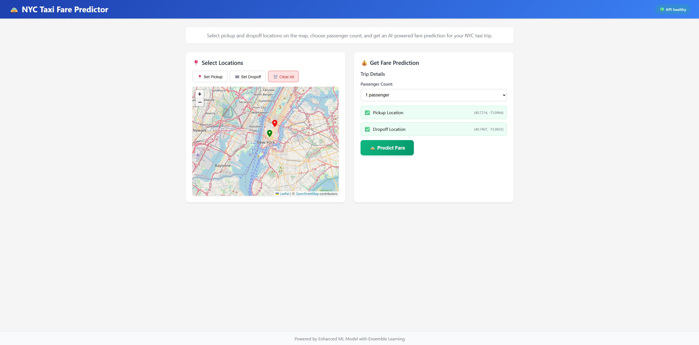

# 🚖 NYC Taxi Fare Predictor

A modern web application that predicts taxi fares in New York City using machine learning. Built with FastAPI backend and React frontend, featuring an interactive map interface and enhanced ensemble ML models.


## 📸 Application Preview



*Interactive map interface showing pickup/dropoff selection and real-time fare prediction*

## ✨ Features

- **🗺️ Interactive Map**: Click-to-select pickup and dropoff locations in NYC
- **🤖 ML-Powered Predictions**: Enhanced ensemble model with XGBoost and Random Forest
- **📊 Detailed Analytics**: Distance, duration, confidence scores, and borough information  
- **🎯 Real-time Validation**: NYC bounds checking and coordinate validation
- **💻 Modern UI**: Responsive React interface with TypeScript
- **🚀 Fast API**: High-performance backend with automatic documentation

## 🛠️ Tech Stack

### Backend
- **FastAPI** - Modern Python web framework
- **XGBoost** - Gradient boosting ML framework
- **scikit-learn** - Machine learning library
- **Pandas & NumPy** - Data processing
- **Pydantic** - Data validation

### Frontend  
- **React 18** - UI framework
- **TypeScript** - Type-safe JavaScript
- **Leaflet** - Interactive maps
- **Vite** - Fast build tool
- **React Hot Toast** - Notifications

### ML Model
- **Ensemble Learning** - XGBoost + Random Forest + Gradient Boosting
- **Feature Engineering** - 21 optimized features including distance, time, and location data
- **Robust Scaling** - Preprocessing for consistent predictions

## 📁 Project Structure
```
nyc-taxi-fare-predictor/
├── README.md                    # Project documentation
├── backend/                     # FastAPI backend
│   ├── app/                     # Application package
│   │   ├── __init__.py
│   │   ├── main.py             # FastAPI application
│   │   ├── models.py           # Pydantic models
│   │   ├── prediction.py       # ML prediction logic
│   │   └── utils.py            # Utility functions
│   ├── models/                  # ML model files
│   ├── requirements.txt         # Python dependencies
│   └── run.py                  # Local development server
├── frontend/                    # React frontend
│   ├── public/                  # Static assets
│   ├── src/                     # Source code
│   │   ├── components/         # React components
│   │   ├── types/              # TypeScript types
│   │   ├── utils/              # Utility functions
│   │   ├── App.tsx             # Main app component
│   │   └── main.tsx            # Entry point
│   ├── package.json            # Node.js dependencies
│   ├── vite.config.ts          # Vite configuration
│   └── tailwind.config.js      # Tailwind CSS config
├── images/                      # Visual assets and documentation
│   ├── screenshots/            # Application screenshots
│   ├── ui/                     # UI assets and logos
│   └── README.md               # Images documentation
├── run.py                       # Development server launcher
├── start-frontend.bat          # Frontend startup script
└── .gitignore                  # Git ignore file
```

## 🚀 Quick Start

### Prerequisites
- Python 3.8+
- Node.js 16+
- Git

### 1. Clone and Setup
```bash
git clone <your-repo>
cd Task_4_5
```

### 2. Backend Setup
```bash
cd backend
pip install -r requirements.txt
python run.py
```
Backend will be available at: http://localhost:8000

### 3. Frontend Setup
```bash
cd frontend
npm install
npm run dev
```
Frontend will be available at: http://localhost:5173

## 🧪 Testing
- Backend API: http://localhost:8000/docs (FastAPI auto-generated docs)
- Health Check: http://localhost:8000/health
- Frontend: http://localhost:5173

## 🔧 Development

### Backend Development
- Uses the enhanced model from Task_4_3_2
- Hot reload enabled for development
- Comprehensive logging and error handling

### Frontend Development
- Vite for fast development and building
- TypeScript for type safety
- Tailwind CSS for styling
- React hooks for state management

## 📊 ML Model Details
- **Source**: Enhanced model from Task_4_3_2
- **Type**: Ensemble model (Random Forest, XGBoost, LightGBM, Gradient Boosting)
- **Features**: Enhanced feature engineering with 17 optimized features
- **Performance**: Significantly improved over previous iterations
- **Confidence**: Provides prediction confidence scores

## 🎯 Features
- Interactive map for pickup/dropoff selection
- Real-time fare prediction
- Confidence scoring and error estimation
- Input validation and error handling
- Responsive design for all devices
- Local development optimized

## 🛠️ Tech Stack
- **Backend**: FastAPI, Python, scikit-learn, pandas, numpy
- **Frontend**: React, TypeScript, Vite, Tailwind CSS
- **Development**: Hot reload, auto-restart, source maps
- **Version Control**: Git

---
Built with ❤️ for local development and testing
